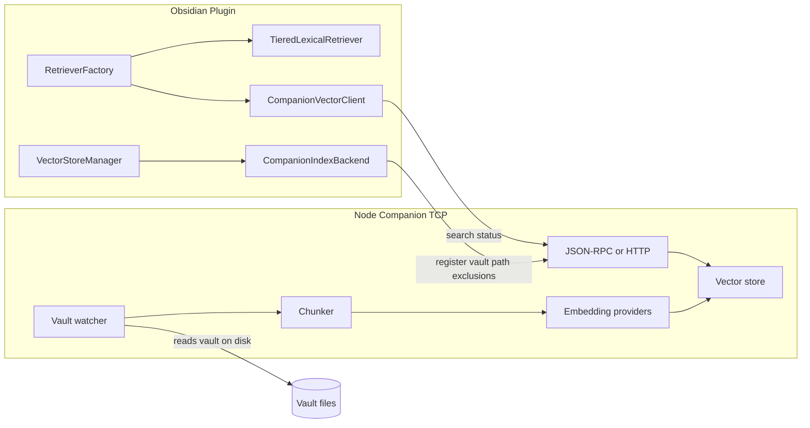

<!-- 89d587c3-2014-44cc-a2d6-c5b40627d8aa -->
---
todos:
  - id: "phase0-spike"
    content: "Spike: companion HTTP health/search + plugin CompanionVectorClient + QA connection test"
    status: pending
  - id: "protocol-types"
    content: "Define shared protocol types (register, scan, search, stats) in companion/protocol"
    status: pending
  - id: "companion-mvp"
    content: "Build companion: vault register, full scan (pull), chunk, embed, LanceDB/sqlite-vec store"
    status: pending
  - id: "plugin-backends"
    content: "Implement CompanionIndexBackend + wire VectorStoreManager/RetrieverFactory/MergedSemanticRetriever"
    status: pending
  - id: "settings-ux"
    content: "Add enableVectorCompanion + host/port settings and health UI in QASettings"
    status: pending
  - id: "phase2-watch"
    content: "Add chokidar watcher, incremental index, scan job progress API"
    status: pending
  - id: "docs-nix"
    content: "Document companion in docs/ + AGENTS.md + flake app for companion process"
    status: pending
isProject: false
---
# Localhost Vector Companion (Pull Model)

## How far away are you today?

| Layer | Status | Notes |
|-------|--------|-------|
| **Query abstraction** | ~60% | [`VectorSearchBackend`](src/search/selfHostRetriever.ts) + [`SelfHostRetriever`](src/search/selfHostRetriever.ts) already define `search()` / `searchByVector()` / `isAvailable()`. Nothing registers a localhost implementation today (`registerSelfHostedBackend` is never called). |
| **Index abstraction** | ~50% | [`SemanticIndexBackend`](src/search/indexBackend/SemanticIndexBackend.ts) is the right seam. [`MiyoIndexBackend`](src/search/indexBackend/MiyoIndexBackend.ts) is a **pull-model precedent**: Copilot does not chunk, embed, or upsert locally; it triggers scans and reads remote state. |
| **What still hurts performance** | Bottleneck | [`IndexOperations`](src/search/indexOperations.ts) + [`OramaIndexBackend`](src/search/indexBackend/OramaIndexBackend.ts) run **in Obsidian**: `ChunkManager.getChunks` → `embedDocuments` → Orama insert → [`ChunkedStorage`](src/search/chunkedStorage.ts) JSON partitions on disk. Query path uses deprecated [`HybridRetriever`](src/search/hybridRetriever.ts) → in-process Orama `search()`. [`MergedSemanticRetriever`](src/search/v3/MergedSemanticRetriever.ts) runs **both** v3 lexical (fast) and Orama semantic (slow) per query. |
| **Lexical search** | Keep in-plugin | Search v3 ([`TieredLexicalRetriever`](src/search/v3/TieredLexicalRetriever.ts)) is separate and should **not** move to the companion initially. |

**Bottom line:** The plugin already sketched “remote vector service” twice (Miyo + self-host retriever). A generic localhost companion is **not a greenfield rewrite**—it is **extending those patterns** with a new backend and turning off the Orama path when the companion is active. Rough effort: **MVP (search + manual full scan) 3–4 weeks**; **production pull indexer with watch + settings UX 6–10 weeks** for one engineer.



---

## Design decisions (locked: pull model)

**Companion owns:**
- Filesystem access to the vault root (absolute path from Obsidian `vault.adapter.getBasePath()` or equivalent)
- Include/exclude patterns (mirror [`qaInclusions`](src/settings/model.ts) / [`qaExclusions`](src/settings/model.ts) + [`shouldIndexFile`](src/search/searchUtils.ts) semantics)
- Chunking (port or reimplement rules compatible with v3 chunk IDs: `note.md#N` from [`ChunkManager`](src/search/v3/chunks))
- Embedding calls (OpenAI, Ollama, etc.—companion holds API keys, not Obsidian)
- Vector storage + ANN search (recommend **LanceDB** or **sqlite-vec** for single-user localhost; avoid shipping Qdrant unless you need multi-collection ops)

**Plugin owns:**
- Lexical Search v3 (unchanged)
- Vault metadata for UI (titles, links)—companion returns `path`, `chunk_index`, `score`, `chunk_text`
- Settings UI: host, port, vault registration, health, index status
- Thin TCP client only—**no** `embedDocuments` / Orama when companion mode is on

**Transport:** User asked for localhost **TCP**. Practical approach:
- **Phase 1:** HTTP/1.1 on `127.0.0.1:<port>` (still TCP; works with Obsidian [`requestUrl`](src/utils.ts) like Miyo/Ollama probes in [`LocalServicesSection`](src/settings/v2/components/LocalServicesSection.tsx))
- **Phase 2 (optional):** length-prefixed JSON frames on a second port for bulk scan progress streaming

Bind to `127.0.0.1` only; optional shared secret header.

---

## Companion service layout (new package)

Add repo sibling package, e.g. [`companion/`](companion/) (or separate repo later):

```
companion/
  src/
    server.ts          # HTTP + health
    protocol/          # request/response types (shared with plugin)
    vault/
      register.ts      # vault id, root path, patterns
      watcher.ts       # chokidar debounced
      scanner.ts       # full/incremental scan jobs
    index/
      chunker.ts       # align chunk boundaries with plugin v3 where possible
      embedder.ts      # provider adapters
      store.ts         # LanceDB / sqlite-vec
    search/
      query.ts         # embed query + ANN + filters
  package.json
```

Run via `node companion/dist/server.js` or `nix develop -c npm run companion`; document in [`AGENTS.md`](AGENTS.md) and user doc under `docs/`.

---

## Protocol (minimal MVP surface)

Align with existing types in [`SemanticIndexDocument`](src/search/indexBackend/SemanticIndexBackend.ts) and [`VectorSearchResult`](src/search/selfHostRetriever.ts).

| Method | Purpose |
|--------|---------|
| `GET /health` | `isAvailable()` |
| `POST /vaults/register` | `{ vaultId, rootPath, inclusions, exclusions, embeddingModel }` |
| `POST /vaults/{id}/scan` | `{ full?: boolean }` — async job id |
| `GET /vaults/{id}/scan/{jobId}` | progress: indexed/total/errors |
| `DELETE /vaults/{id}/index` | clear index |
| `POST /vaults/{id}/search` | `{ query, limit, minScore, filter? }` → `VectorSearchResult[]` |
| `GET /vaults/{id}/stats` | indexed file count, embedding model, dimension |

Plugin sends **vault root path** on register; companion never needs note content over the wire for indexing (pull from disk). Plugin may re-send pattern updates when QA settings change.

---

## Plugin integration (surgical changes)

### 1. Settings ([`src/settings/model.ts`](src/settings/model.ts), [`QASettings.tsx`](src/settings/v2/components/QASettings.tsx))

New settings (names illustrative):
- `enableVectorCompanion: boolean`
- `vectorCompanionHost: string` (default `127.0.0.1`)
- `vectorCompanionPort: number`
- `vectorCompanionToken?: string`

When enabled: disable Orama indexing UI paths that imply local embed work; show companion health + “Scan vault on companion”.

### 2. New backends

- **`CompanionVectorClient`** implements [`VectorSearchBackend`](src/search/selfHostRetriever.ts) via `requestUrl`
- **`CompanionIndexBackend`** implements [`SemanticIndexBackend`](src/search/indexBackend/SemanticIndexBackend.ts):
  - `requiresEmbeddings()` → `false`
  - `isRemoteBackend()` → `true` (skips mobile local-index guard like Miyo in [`indexEventHandler`](src/search/indexEventHandler.ts))
  - `upsert` / `upsertBatch` → no-ops with log (Miyo pattern)
  - `indexVaultToVectorStore` → `POST /scan` only
  - `getIndexedFiles`, `hasIndex`, `garbageCollect` → companion API

### 3. Wire into existing managers

- [`VectorStoreManager`](src/search/vectorStoreManager.ts): third backend key `companion` alongside `orama` | `miyo`; selection when `enableVectorCompanion && health ok`
- [`RetrieverFactory`](src/search/RetrieverFactory.ts):
  - Register `CompanionVectorClient` at plugin load
  - When companion active: use `SelfHostRetriever` **or** teach `MergedSemanticRetriever` to accept injected semantic retriever that hits companion (preserve lexical + semantic merge)
- **Disable** [`IndexEventHandler`](src/search/indexEventHandler.ts) active-leaf reindex when companion pulls via watcher (optional: companion-only debounced scan trigger on save is redundant)

### 4. Deprecation path (no big-bang)

- `enableVectorCompanion` off → current Orama behavior unchanged
- On → bypass [`HybridRetriever`](src/search/hybridRetriever.ts) / [`DBOperations`](src/search/dbOperations.ts) for semantic leg only
- Comments about `MemoryIndexManager` remain aspirational; do not block companion on that migration

---

## Phased delivery

### Phase 0 — Spike (3–5 days)
- Companion `health` + `search` on a pre-built tiny index
- Plugin `CompanionVectorClient` + manual “test connection” in QA settings
- Confirm `requestUrl` to `127.0.0.1` works on your OS

### Phase 1 — Pull indexer MVP (2–3 weeks)
- `register` + full `scan` reading vault directory
- Chunk + embed + store in LanceDB/sqlite-vec
- Plugin: `CompanionIndexBackend`, scan command replaces local force-reindex
- `MergedSemanticRetriever` semantic leg → companion search only

### Phase 2 — Incremental + ops (2–3 weeks)
- Filesystem watcher (debounced), incremental upsert/delete by path
- Job progress WS or polling; surface in existing indexing progress UI ([`aiParams`](src/aiParams.ts) indexing state)
- GC / model-change → companion rebuild endpoint
- Nix flake app: `nix run .#companion`

### Phase 3 — Hardening (2+ weeks)
- Multi-vault support (vaultId = hash of root path)
- Auth token, config file for embedding keys on companion side
- Docs: [`docs/vault-search-and-indexing.md`](docs/vault-search-and-indexing.md) companion section
- Optional: share protocol types in `companion/protocol` imported by plugin build

---

## Risks and mitigations

| Risk | Mitigation |
|------|------------|
| Chunk ID mismatch between lexical v3 and companion semantic | Document chunking spec; port same split rules from [`src/search/v3/chunks`](src/search/v3/chunks) or accept separate IDs for semantic-only results |
| Obsidian Sync / mobile | Companion is desktop-only; mobile uses lexical-only or remote companion URL (same as Miyo mobile rule) |
| Vault path vs URI | Register **filesystem** base path; normalize like [`getMiyoFilePath`](src/miyo/miyoUtils.ts) |
| Large vault first scan | Background job + progress; rate-limit embeddings on companion |
| User must run companion process | Settings health indicator + clear error in [`RetrieverFactory`](src/search/RetrieverFactory.ts) fallback to lexical-only with Notice |

---

## What you can use immediately (workaround until built)

- **Lexical only:** turn off Semantic Search; keep v3 lexical (likely usable today)
- **Miyo / self-host:** if you have Plus/self-host, [`MiyoIndexBackend`](src/search/indexBackend/MiyoIndexBackend.ts) already externalizes indexing—different product, same architecture class as this companion

---

## Success criteria

- Full vault reindex completes without Obsidian UI freeze beyond progress bar updates
- Vault QA query latency dominated by one localhost RTT + ANN, not Orama load/JSON parse in-plugin
- Embedding API keys configured only in companion config
- Disabling companion restores current Orama path with no data loss in vault
