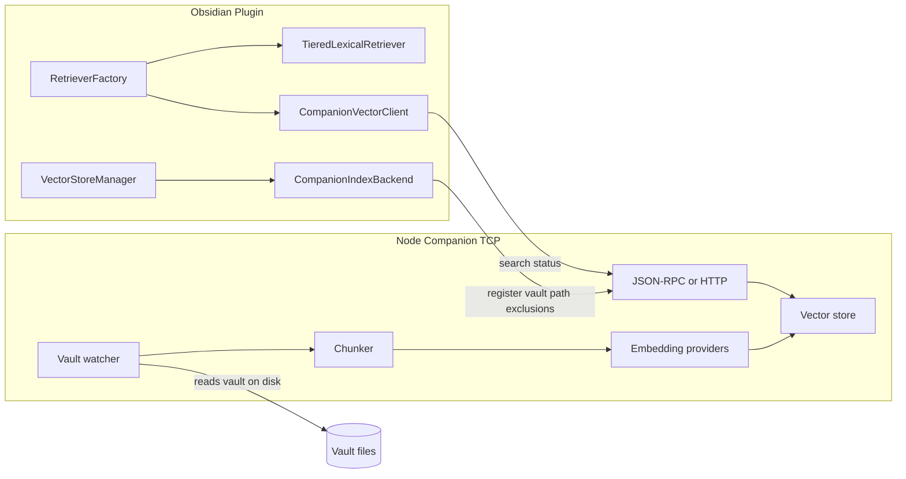

<!-- 89d587c3-2014-44cc-a2d6-c5b40627d8aa -->
---
todos:
  - id: "phase0-spike"
    content: "Spike: companion HTTP health/search + plugin CompanionVectorClient + QA connection test"
    status: completed
  - id: "protocol-types"
    content: "Define shared protocol types (register, scan, search, stats) in companion/protocol"
    status: pending
  - id: "companion-mvp"
    content: "Build companion: vault register, full scan (pull), chunk, embed, LanceDB/sqlite-vec store"
    status: pending
  - id: "plugin-backends"
    content: "Implement CompanionIndexBackend + wire VectorStoreManager/RetrieverFactory/MergedSemanticRetriever"
    status: pending
  - id: "settings-ux"
    content: "Add enableVectorCompanion + host/port settings and health UI in QASettings"
    status: completed
  - id: "phase2-watch"
    content: "Add chokidar watcher, incremental index, scan job progress API"
    status: pending
  - id: "docs-nix"
    content: "Document companion in docs/ + AGENTS.md + flake app for companion process"
    status: pending
isProject: false
---
# Localhost Vector Companion (Pull Model)

## How far away are you today?

| Layer | Status | Notes |
|-------|--------|-------|
| **Query abstraction** | ~60% | [`VectorSearchBackend`](src/search/selfHostRetriever.ts) + [`SelfHostRetriever`](src/search/selfHostRetriever.ts) already define `search()` / `searchByVector()` / `isAvailable()`. Nothing registers a localhost implementation today (`registerSelfHostedBackend` is never called). |
| **Index abstraction** | ~50% | [`SemanticIndexBackend`](src/search/indexBackend/SemanticIndexBackend.ts) is the right seam. [`MiyoIndexBackend`](src/search/indexBackend/MiyoIndexBackend.ts) is a **pull-model precedent**: Copilot does not chunk, embed, or upsert locally; it triggers scans and reads remote state. |
| **What still hurts performance** | Bottleneck | [`IndexOperations`](src/search/indexOperations.ts) + [`OramaIndexBackend`](src/search/indexBackend/OramaIndexBackend.ts) run **in Obsidian**: `ChunkManager.getChunks` → `embedDocuments` → Orama insert → [`ChunkedStorage`](src/search/chunkedStorage.ts) JSON partitions on disk. Query path uses deprecated [`HybridRetriever`](src/search/hybridRetriever.ts) → in-process Orama `search()`. [`MergedSemanticRetriever`](src/search/v3/MergedSemanticRetriever.ts) runs **both** v3 lexical (fast) and Orama semantic (slow) per query. |
| **Lexical search** | Keep in-plugin | Search v3 ([`TieredLexicalRetriever`](src/search/v3/TieredLexicalRetriever.ts)) is separate and should **not** move to the companion initially. |

**Bottom line:** The plugin already sketched “remote vector service” twice (Miyo + self-host retriever). A generic localhost companion is **not a greenfield rewrite**—it is **extending those patterns** with a new backend and turning off the Orama path when the companion is active. Rough effort: **MVP (search + manual full scan) 3–4 weeks**; **production pull indexer with watch + settings UX 6–10 weeks** for one engineer.



---

## Design decisions (locked: pull model)

**Companion owns:**
- Filesystem access to the vault root (absolute path from Obsidian `vault.adapter.getBasePath()` or equivalent)
- Include/exclude patterns (mirror [`qaInclusions`](src/settings/model.ts) / [`qaExclusions`](src/settings/model.ts) + [`shouldIndexFile`](src/search/searchUtils.ts) semantics)
- Chunking (port or reimplement rules compatible with v3 chunk IDs: `note.md#N` from [`ChunkManager`](src/search/v3/chunks))
- Embedding calls (OpenAI, Ollama, etc.—companion holds API keys, not Obsidian)
- Vector storage + ANN search (recommend **LanceDB** or **sqlite-vec** for single-user localhost; avoid shipping Qdrant unless you need multi-collection ops)

**Plugin owns:**
- Lexical Search v3 (unchanged)
- Vault metadata for UI (titles, links)—companion returns `path`, `chunk_index`, `score`, `chunk_text`
- Settings UI: host, port, vault registration, health, index status
- Thin TCP client only—**no** `embedDocuments` / Orama when companion mode is on

**Transport:** User asked for localhost **TCP**. Practical approach:
- **Phase 1:** HTTP/1.1 on `127.0.0.1:<port>` (still TCP; works with Obsidian [`requestUrl`](src/utils.ts) like Miyo/Ollama probes in [`LocalServicesSection`](src/settings/v2/components/LocalServicesSection.tsx))
- **Phase 2 (optional):** length-prefixed JSON frames on a second port for bulk scan progress streaming

Bind to `127.0.0.1` only; optional shared secret header.

---

## Companion service layout (new package)

Add repo sibling package, e.g. [`companion/`](companion/) (or separate repo later):

```
companion/
  src/
    server.ts          # HTTP + health
    protocol/          # request/response types (shared with plugin)
    vault/
      register.ts      # vault id, root path, patterns
      watcher.ts       # chokidar debounced
      scanner.ts       # full/incremental scan jobs
    index/
      chunker.ts       # align chunk boundaries with plugin v3 where possible
      embedder.ts      # provider adapters
      store.ts         # LanceDB / sqlite-vec
    search/
      query.ts         # embed query + ANN + filters
  package.json
```

Run via `node companion/dist/server.js` or `nix develop -c npm run companion`; document in [`AGENTS.md`](AGENTS.md) and user doc under `docs/`.

---

## Protocol (minimal MVP surface)

Align with existing types in [`SemanticIndexDocument`](src/search/indexBackend/SemanticIndexBackend.ts) and [`VectorSearchResult`](src/search/selfHostRetriever.ts).

| Method | Purpose |
|--------|---------|
| `GET /health` | `isAvailable()` |
| `POST /vaults/register` | `{ vaultId, rootPath, inclusions, exclusions, embeddingModel }` |
| `POST /vaults/{id}/scan` | `{ full?: boolean }` — async job id |
| `GET /vaults/{id}/scan/{jobId}` | progress: indexed/total/errors |
| `DELETE /vaults/{id}/index` | clear index |
| `POST /vaults/{id}/search` | `{ query, limit, minScore, filter? }` → `VectorSearchResult[]` |
| `GET /vaults/{id}/stats` | indexed file count, embedding model, dimension |

Plugin sends **vault root path** on register; companion never needs note content over the wire for indexing (pull from disk). Plugin may re-send pattern updates when QA settings change.

---

## Plugin integration (surgical changes)

### 1. Settings ([`src/settings/model.ts`](src/settings/model.ts), [`QASettings.tsx`](src/settings/v2/components/QASettings.tsx))

New settings (names illustrative):
- `enableVectorCompanion: boolean`
- `vectorCompanionHost: string` (default `127.0.0.1`)
- `vectorCompanionPort: number`
- `vectorCompanionToken?: string`

When enabled: disable Orama indexing UI paths that imply local embed work; show companion health + “Scan vault on companion”.

### 2. New backends

- **`CompanionVectorClient`** implements [`VectorSearchBackend`](src/search/selfHostRetriever.ts) via `requestUrl`
- **`CompanionIndexBackend`** implements [`SemanticIndexBackend`](src/search/indexBackend/SemanticIndexBackend.ts):
  - `requiresEmbeddings()` → `false`
  - `isRemoteBackend()` → `true` (skips mobile local-index guard like Miyo in [`indexEventHandler`](src/search/indexEventHandler.ts))
  - `upsert` / `upsertBatch` → no-ops with log (Miyo pattern)
  - `indexVaultToVectorStore` → `POST /scan` only
  - `getIndexedFiles`, `hasIndex`, `garbageCollect` → companion API

### 3. Wire into existing managers

- [`VectorStoreManager`](src/search/vectorStoreManager.ts): third backend key `companion` alongside `orama` | `miyo`; selection when `enableVectorCompanion && health ok`
- [`RetrieverFactory`](src/search/RetrieverFactory.ts):
  - Register `CompanionVectorClient` at plugin load
  - When companion active: use `SelfHostRetriever` **or** teach `MergedSemanticRetriever` to accept injected semantic retriever that hits companion (preserve lexical + semantic merge)
- **Disable** [`IndexEventHandler`](src/search/indexEventHandler.ts) active-leaf reindex when companion pulls via watcher (optional: companion-only debounced scan trigger on save is redundant)

### 4. Deprecation path (no big-bang)

- `enableVectorCompanion` off → current Orama behavior unchanged
- On → bypass [`HybridRetriever`](src/search/hybridRetriever.ts) / [`DBOperations`](src/search/dbOperations.ts) for semantic leg only
- Comments about `MemoryIndexManager` remain aspirational; do not block companion on that migration

---

## Phased delivery

### Phase 0 — Spike (DONE)

Implemented end-to-end on Linux against `127.0.0.1:7261`.

**Companion package** ([`companion/`](companion/)):
- `companion/src/server.ts` — `node:http` server, `GET /health` (unauthenticated) and `POST /vaults/:id/search` (bearer-token-gated when `COMPANION_TOKEN` is set). 64 KiB body cap. Binds loopback by default.
- `companion/src/index/store.ts` — `better-sqlite3` + `sqlite-vec` (`vec0` virtual table). Schema: `chunks(rowid INTEGER PK AUTOINC, id UNIQUE, vault_id, path, chunk_index, content, title, mtime)` + `vec_chunks(embedding float[128])`. Upsert is an explicit "lookup-then-update-or-insert" because `vec_chunks` only accepts integer rowids — `RETURNING rowid` from an `ON CONFLICT` upsert bound as a non-integer and tripped `SqliteError: Only integers are allowed for primary key values on vec_chunks`. The fix is to maintain our own integer rowid and bind it as `BigInt`. Phase 1 must keep this invariant.
- `companion/src/index/embedder.ts` — deterministic FNV-1a hash bag-of-words → L2-normed `Float32Array` of dim 128. Cosine-similarity-by-token-overlap, **not semantic**. Replaced in Phase 1; changing the hash function or dim requires re-seeding.
- `companion/src/seed.ts` — hand-seeds 5 demo docs under `vault_id="default"`. Smoke test: `curl -X POST http://127.0.0.1:7261/vaults/default/search -d '{"query":"machine learning neural networks"}'` returns ranked ML chunks first.
- `companion/src/protocol/types.ts` — `VectorSearchResult`, `SearchRequest`, `HealthResponse`. Shape-compatible with the plugin's `VectorSearchResult` in [`src/search/selfHostRetriever.ts`](src/search/selfHostRetriever.ts).

**Plugin wiring:**
- [`src/search/companion/CompanionVectorClient.ts`](src/search/companion/CompanionVectorClient.ts) — implements [`VectorSearchBackend`](src/search/selfHostRetriever.ts). Uses [`safeFetch`](src/utils.ts) (Obsidian `requestUrl` under the hood — CORS-free, no AbortSignal). `health()` caches the dimension. `searchByVector()` is a logged stub (companion embeds server-side).
- [`src/search/companion/companionRegistry.ts`](src/search/companion/companionRegistry.ts) — module-level singleton that owns lifecycle: `applySettings(settings)` constructs/updates the client and toggles `RetrieverFactory.registerSelfHostedBackend()` / `clearSelfHostedBackend()`. Called from [`src/main.ts`](src/main.ts) on `onload` and inside the `subscribeToSettingsChange` callback.
- New settings on `CopilotSettings` ([`src/settings/model.ts`](src/settings/model.ts)) with defaults in [`src/constants.ts`](src/constants.ts): `enableVectorCompanion=false`, `vectorCompanionHost="127.0.0.1"`, `vectorCompanionPort=7261`, `vectorCompanionToken=""`, `vectorCompanionVaultId="default"`. Sanitizer untouched — all fields have safe defaults.
- New `VectorCompanionSection` in [`src/settings/v2/components/QASettings.tsx`](src/settings/v2/components/QASettings.tsx) with switch, host, port, token (PasswordInput), vault id, and a "Test connection" button that probes `/health` using current (possibly unsaved) form values via a one-off `CompanionVectorClient`.

**Findings that change Phase 1:**

| Finding | Source | Implication |
|---|---|---|
| `RetrieverFactory.registerSelfHostedBackend()` exists but is **never called** anywhere today. | `RetrieverFactory.ts:106-117` | Phase 0 registers it from `companionRegistry`. Phase 1 should add a dedicated `companion` priority arm in `RetrieverFactory.createRetriever()` so it doesn't ride on `isSelfHostModeValid()` / `selfHostUrl`, which gate the existing self-host path. |
| `MergedSemanticRetriever` accepts a `semanticRetriever?` override in its constructor. | `MergedSemanticRetriever.ts:39-75` | Cleanest Phase 1 wiring: build a `SelfHostRetriever(companionClient)` and pass it as the semantic leg, leaving lexical (`TieredLexicalRetriever`) untouched. No need to disable v3. |
| `IndexEventHandler.shouldHandleEvents()` already skips active-leaf reindex when `isRemoteBackend() && !requiresEmbeddings()`. | `indexEventHandler.ts:32-43` | Phase 1's `CompanionIndexBackend` should return `isRemoteBackend()=true`, `requiresEmbeddings()=false`. No new guard code needed. |
| Mobile guard `Platform.isMobile && disableIndexOnMobile && !isRemoteBackend()` already exempts remote backends. | `vectorStoreManager.ts:143-148` | Same; nothing extra to add. |
| Settings have **no version field**; `sanitizeSettings()` just merges over `DEFAULT_SETTINGS`. | `settings/model.ts:359-476` | Adding new fields is additive; no migration needed for any companion setting. |
| `safeFetch` does **not** honor `AbortSignal` and buffers the full response. | `utils.ts:651-723` | Acceptable for sub-second JSON. Scan-progress streaming in Phase 2 cannot use `safeFetch`; either poll or fall back to native `fetch` (desktop only). |
| Chunk ID format in v3 is `note_path#index` (0-based, non-padded). | `src/search/v3/chunks.ts:11,581` | Companion already follows this; Phase 1 must preserve it when porting the chunker so semantic + lexical results merge cleanly in `MergedSemanticRetriever`. |
| Default chunk size is `CHUNK_SIZE = 6000` chars, heading-first markdown splitter, `overlap=0`. | `src/constants.ts:121` + `src/search/v3/chunks.ts:48-62` | Port these constants verbatim to companion's chunker. |
| Pattern semantics live in `categorizePatterns()`: `#tag`, `*.ext`, `[[note]]`, else folder pattern. | `src/search/searchUtils.ts:166-185` | Phase 1 companion can either re-implement this client-side (preferred — port the regex) or accept already-categorized lists in the `register` payload. |
| `sqlite-vec`'s `vec0` virtual table only accepts integer rowids and does not support filtering by non-vec columns inside `MATCH`. | empirical (Phase 0 SqliteError); sqlite-vec docs | We over-fetch `k*4` and filter by `vault_id` in SQL afterward. If multi-vault becomes a hot path (Phase 3), consider one `vec_chunks` per vault. |
| Embedder is content-addressable: changing the embedding function invalidates every stored vector. | architectural | Companion needs an embedding-model identifier stored alongside vectors so Phase 1 can detect mismatches and trigger rebuilds. |

- Confirmed: Obsidian's `requestUrl` (via `safeFetch`) reaches `127.0.0.1` on Linux with no CORS/header surprises.

### Phase 1 — Pull indexer MVP (2–3 weeks)

**Companion (new):**
- `companion/src/vault/register.ts` — `POST /vaults/register { vaultId, rootPath, inclusions, exclusions, embeddingModel }`. Persist to a `vaults` table; reject if `rootPath` doesn't exist or isn't a directory. Port `categorizePatterns()` (see finding above) so server-side filtering matches plugin semantics.
- `companion/src/vault/scanner.ts` — `POST /vaults/:id/scan { full?: boolean }` returns `{ jobId }`; `GET /vaults/:id/scan/:jobId` returns `{ state: queued|running|done|error, indexed, total, errors[] }`. Job runs async in-process. Walk vault root with `fs.readdir({ recursive: true })`, filter by patterns, read mtime, skip if `chunks.mtime >= file.mtime`.
- `companion/src/index/chunker.ts` — port markdown heading-first splitter with `CHUNK_SIZE=6000`, `overlap=0`. Emit `id = "<relpath>#<index>"`. Either reuse LangChain `RecursiveCharacterTextSplitter` (matches plugin output byte-for-byte) or write a minimal port. Add a `chunks.test.ts` fixture suite cross-checking output against the plugin's v3 chunks for at least 3 representative notes.
- `companion/src/index/embedder.ts` — replace pseudo-embedder with provider adapters: `openai` (env: `OPENAI_API_KEY`, model configurable), `ollama` (env: `OLLAMA_HOST`, default `http://127.0.0.1:11434`). Store `embedding_model` (string id) and `dim` on a `meta` table; on register, reject scan if requested model ≠ stored model unless `force=true` (triggers rebuild).
- `DELETE /vaults/:id/index` — clear `chunks` + `vec_chunks` for the vault.
- `GET /vaults/:id/stats` — `{ indexedFiles, embeddingModel, dimension, lastScanAt }`.

**Plugin:**
- `src/search/companion/CompanionIndexBackend.ts` — implement `SemanticIndexBackend`:
  - `requiresEmbeddings()=false`, `isRemoteBackend()=true`
  - `upsert` / `upsertBatch` → no-op + `logInfo` (mirror `MiyoIndexBackend.ts:58-100`)
  - `indexVaultToVectorStore` → `POST /vaults/:id/scan`, poll progress, surface in existing UI
  - `clearIndex` → `DELETE /vaults/:id/index`
  - `getIndexedFiles` / `hasIndex` / `getLatestFileMtime` → companion API
  - `garbageCollect` → no-op
- `src/search/vectorStoreManager.ts` — extend `activeBackendKey` to `"orama" | "miyo" | "companion"`. Construct `companionBackend` in the constructor; pick it in `getBackendKey()` when `settings.enableVectorCompanion`. Refresh on settings change.
- `src/search/RetrieverFactory.ts` — add a dedicated companion arm **before** the self-host arm:
  ```ts
  if (currentSettings.enableVectorCompanion) {
    const backend = companionRegistry.get();
    if (backend && await backend.isAvailable()) {
      const semantic = new SelfHostRetriever(app, backend, normalizedOptions);
      return {
        retriever: new MergedSemanticRetriever(app, options, semantic),
        type: "companion",
        reason: "companion mode enabled",
      };
    }
  }
  ```
  Keep lexical fallback if `isAvailable()` returns false; surface a `Notice` once per session.
- Vault root sent at register time: `app.vault.adapter.getBasePath?.()` on desktop. Mobile has no FS root → companion mode is desktop-only; gate the settings UI with `Platform.isDesktopApp` if needed (or document the limitation).

**Tests:**
- `companion/src/index/chunker.test.ts` — golden output cross-check vs plugin v3.
- `companion/src/index/store.test.ts` — upsert / search / cosine math sanity.
- `src/search/companion/CompanionVectorClient.test.ts` — mock `safeFetch`, assert URL path, headers, error swallowing.
- `src/search/companion/CompanionIndexBackend.test.ts` — assert no-op upserts, scan-trigger semantics.

**Out of scope until Phase 2:** watcher, real-time updates, job WebSocket, settings UI for embedding model selection on the companion side.

### Phase 2 — Incremental + ops (2–3 weeks)

**Companion:**
- `companion/src/vault/watcher.ts` — `chokidar.watch(rootPath, { ignoreInitial: true, awaitWriteFinish: { stabilityThreshold: 500 } })`. Events: `add` → chunk + upsert; `change` → delete-by-path + chunk + upsert; `unlink` → delete-by-path. Re-apply include/exclude patterns on every event. Persist a per-vault `last_event_at` to skip re-walks on restart.
- Scan-progress streaming: easier path is plugin polling `GET /vaults/:id/scan/:jobId` every 500 ms (works through `safeFetch`); WS only if polling overhead is observable. Avoid SSE — `requestUrl` doesn't stream.
- Embedding rate limiter — token-bucket per provider, configurable via env. Surface `429` retries with backoff.
- Concurrent-scan guard — `POST /scan` while another job is `running` returns existing `jobId` (idempotent).
- Model-change handling — if `register` sends a new `embeddingModel`, return `409` unless `force=true`; on force, atomically `DELETE FROM vec_chunks` + drop+recreate `vec_chunks` with new dim + enqueue full scan.

**Plugin:**
- Hook companion scan progress into the existing indexing progress UI ([`aiParams`](src/aiParams.ts) indexing state already feeds a status bar). `CompanionIndexBackend.indexVaultToVectorStore` polls and emits the same events.
- Re-register companion patterns when `qaInclusions` / `qaExclusions` change (subscribe in `companionRegistry`).
- Disable `IndexEventHandler`'s active-leaf reindex when companion is active — already covered by the existing `shouldHandleEvents()` guard since `CompanionIndexBackend.isRemoteBackend()=true`. Confirm with a unit test.
- Mobile: settings UI hides the toggle when `!Platform.isDesktopApp`, with a tooltip linking to docs (companion is loopback-only; running it on a phone is out of scope).

**Operational:**
- `flake.nix` — add a `companion` app: `nix run .#companion` builds + runs `node companion/dist/server.js`. Document `nix develop -c npm --prefix companion run dev` for iteration.
- `companion/Dockerfile` (optional) — for users who want to run the companion in a container.
- Health UI in `VectorCompanionSection`: poll `/health` every N seconds while the QA tab is open; show indexed-chunks count + dimension. Reuse the spike's `health()` cache.

**Tests:**
- `companion/src/vault/watcher.test.ts` — fixture vault, simulate file events, assert upsert / delete calls.
- Integration test (gated by env): start companion in-process, run full scan against `__tests__/fixtures/vault`, query, assert non-empty hits.

### Phase 3 — Hardening (2+ weeks)
- Multi-vault support (vaultId = hash of root path)
- Auth token, config file for embedding keys on companion side
- Docs: [`docs/vault-search-and-indexing.md`](docs/vault-search-and-indexing.md) companion section
- Optional: share protocol types in `companion/protocol` imported by plugin build

---

## Risks and mitigations

| Risk | Mitigation |
|------|------------|
| Chunk ID mismatch between lexical v3 and companion semantic | Document chunking spec; port same split rules from [`src/search/v3/chunks`](src/search/v3/chunks) or accept separate IDs for semantic-only results |
| Obsidian Sync / mobile | Companion is desktop-only; mobile uses lexical-only or remote companion URL (same as Miyo mobile rule) |
| Vault path vs URI | Register **filesystem** base path; normalize like [`getMiyoFilePath`](src/miyo/miyoUtils.ts) |
| Large vault first scan | Background job + progress; rate-limit embeddings on companion |
| User must run companion process | Settings health indicator + clear error in [`RetrieverFactory`](src/search/RetrieverFactory.ts) fallback to lexical-only with Notice |

---

## What you can use immediately (workaround until built)

- **Lexical only:** turn off Semantic Search; keep v3 lexical (likely usable today)
- **Miyo / self-host:** if you have Plus/self-host, [`MiyoIndexBackend`](src/search/indexBackend/MiyoIndexBackend.ts) already externalizes indexing—different product, same architecture class as this companion

---

## Success criteria

- Full vault reindex completes without Obsidian UI freeze beyond progress bar updates
- Vault QA query latency dominated by one localhost RTT + ANN, not Orama load/JSON parse in-plugin
- Embedding API keys configured only in companion config
- Disabling companion restores current Orama path with no data loss in vault
